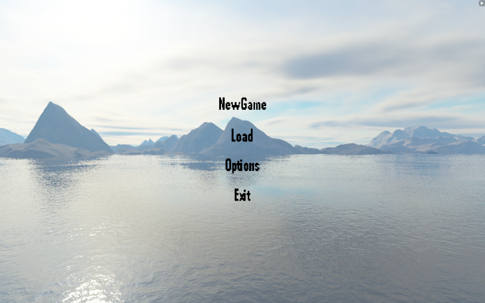
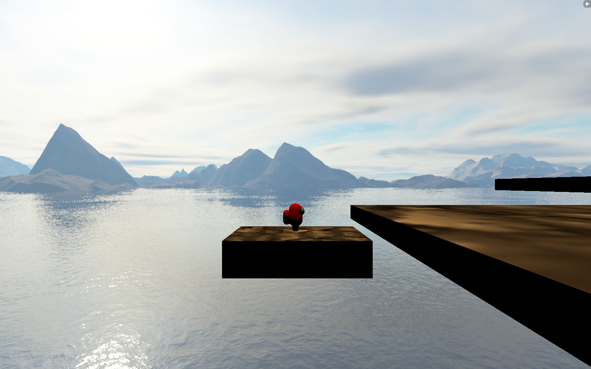
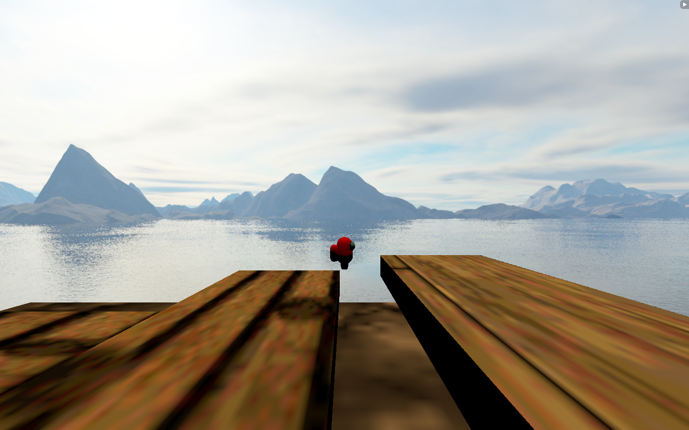

Platformer 3D
===

3D Platformer made from scratch using Physic and Render Engines made from scratch too (using OpenGL 4.5, stb, GLFW, Glad and ImGui).

**/!\ This engine is not the most optimized one nor the most efficient one. It supports only .obj models, .mtl materials and a custom scene format. /!\\**

Controls
---
- **WASD/ZQSD** keys: Move foward, backward, left and right.
- **Space**: Jump.
- **Escape**: Return to Main menu.
- **F5/F9**: Save the current party/Load the last party.
- **Directional arrows**: Move the camera.

# Engine Features
* The Game Engine uses a powerful leak-free Component System
* The Game Engine is formed by the Render Engine and the Physic Engine
* The Game Engine supports UI system and button callback

# In-Game Features
* The player can launch the game from the main menu
* The player can load an old save from the main menu or with the keyboard In-Game
* The player can exit the game from the main menu
* The player can move in an 3D-environment while being in game
* The player can move its camera

***Annexes***
===
- Link to the UML:
https://miro.com/app/board/o9J_lIRYkLw=/

***Exemples***
===

Screenshot of the main menu

Screenshot of the In-Game scene

Screenshot of the player jump

***Known issues***
===
- There are collision bugs on the edge of the platforms because of the quaternions.

***Work in progress and future features***
===
WIP
---
- Edit the inputs from the main menu

Next features
---
- Editing the current scene in game by adding new GameObjects and link component
- IA system with enemies

***Third-party programs and libraries***
===

# Download links

stb
---
https://github.com/nothings/stb

GLFW
---
https://www.glfw.org/

Glad
---
https://glad.dav1d.de/

***References***
===
OpenGL:
---
- Gives the different functions of OpenGL:
http://docs.gl/
- Ditto:
https://www.khronos.org/opengl/

C++:
---
- C++ references: https://en.cppreference.com/